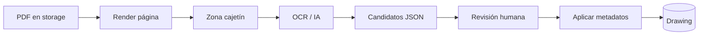

# Investigación técnica OCR/IA para planos PDF (Fase 10A)

> **Estado:** experimental / investigación  
> **Alcance:** evaluación aislada. No integrado en detección productiva, palillería ni permisos.  
> **Commit base:** Fase 9F (`70992e5`)

## Contexto actual en palilleria-saas

| Capacidad | Implementación | Limitación |
|-----------|----------------|------------|
| Texto embebido | `pdf-parse` → `getText()` en `lib/drawings/pdf-text-extract.ts` | Solo PDFs con capa de texto |
| Metadatos cajetín | Regex sobre texto embebido (`lib/drawings/parse-pdf-text.ts`) | Depende de texto legible y patrones conocidos |
| Detección productiva | Filename + texto embebido → merge → revisión humana (`detection-apply.ts`) | Sin visión ni OCR |
| UI manual | Extracción de texto bajo demanda (`drawing-pdf-text-extraction.tsx`) | Preview en memoria; no persiste |

Cuando `hasEmbeddedText === false`, el mensaje actual indica plano escaneado o vectorial sin texto — **hueco que OCR/IA debe cubrir**.

---

## Comparativa de enfoques

### 1. Texto embebido actual (baseline)

**Qué es:** extraer strings ya presentes en el PDF (no renderizar píxeles).

| Pros | Contras |
|------|---------|
| Rápido, barato, on-prem | Inútil en escaneados |
| Ya integrado y probado | Orden espacial imperfecto en cajetines complejos |
| Sin datos saliendo del servidor | No lee texto “dibujado” como geometría |

**Cuándo usar:** siempre como **primer paso** (coste ~0).

---

### 2. OCR local (Tesseract, etc.)

**Qué es:** PDF → imagen por página → motor OCR open source.

| Pros | Contras |
|------|---------|
| Privacidad total | Calidad variable en planos técnicos |
| Sin coste por página (solo CPU/RAM) | Requiere binarios/deps nativas |
| Predecible en servidor propio | Lento en PDFs multipágina A0/A1 |
| | Necesita recorte de zonas (cajetín) para precisión |

**Opciones típicas:**

- **Tesseract 5** (+ `tesseract.js` o wrapper CLI): maduro, gratuito, peor en rotaciones/fuentes CAD.
- **ocrmypdf** (preproceso + Tesseract): útil en batch dev, pesado en runtime web.
- **PaddleOCR / docTR**: mejor en documentos, más peso de modelo.

**Cuándo usar:** MVP offline/dev, empresas con restricción cloud, volúmenes moderados.

---

### 3. OCR externo (cloud managed)

**Qué es:** API tipo Google Document AI, Azure Document Intelligence, AWS Textract, OCR.space.

| Pros | Contras |
|------|---------|
| Mejor en layouts complejos | Coste por página |
| Escala sin gestionar GPU | PDF sale del perímetro (privacidad) |
| Algunos detectan tablas/bloques | Latencia de red + cuotas |
| Menos ops de infra | Vendor lock-in |

**Cuándo usar:** piloto 10B con pocos planos/día, o clientes que aceptan DPA cloud.

---

### 4. IA visual / multimodal (GPT-4o, Claude, Gemini, modelos visión)

**Qué es:** imagen (o PDF renderizado) + prompt → JSON estructurado con campos candidatos.

| Pros | Contras |
|------|---------|
| Flexible ante formatos nuevos | Coste alto por plano |
| Puede inferir contexto (“parece revisión”) | Alucinaciones → **revisión humana obligatoria** |
| Un solo prompt para cajetín + notas | Latencia; límites de tamaño/resolución |
| | Privacidad / retención según proveedor |

**Cuándo usar:** asistencia en cajetín y textos ambiguos, **nunca** auto-aplicar a palillería en v1.

---

### 5. Extracción por zonas del cajetín (recomendado como núcleo)

**Qué es:** detectar o configurar ROI (esquina inferior derecha típica en P&ID/isométricos) → OCR/IA solo en esa región.

| Pros | Contras |
|------|---------|
| Menos ruido que OCR full-page | Plantillas varían por cliente/proyecto |
| Más barato (menos píxeles) | Requiere heurística de orientación/escala |
| Encaja con metadatos actuales (nº plano, línea, rev) | Multipágina: ¿cuál es el cajetín oficial? |

**Heurísticas posibles (10B):**

- Última página o página 1 según tipo de documento.
- Región = % ancho/alto desde esquina (p. ej. bottom-right 35×25 %).
- Refinar con detección de rectángulos (líneas del cajetín) vía pdf.js vector ops o visión ligera.

---

### 6. Híbrido por fases (recomendación global)

```
PDF subido
  → [A] Texto embebido (actual)
  → [B] Si insuficiente: render página objetivo (pdf-parse getScreenshot)
  → [C] Recorte cajetín (heurística / template)
  → [D] OCR local OR cloud OR multimodal (solo ROI)
  → [E] Parser regex + normalización (reutilizar parse-pdf-text)
  → [F] Merge con filename (detection-merge existente)
  → [G] Revisión humana (UI tipo “Confirmar metadatos detectados”)
  → [H] Aplicar solo campos confirmados
```

**Palillería / partidas / medidas:** fuera del MVP; solo investigación en 10A.

---

## Pipeline objetivo (producto futuro)



Principios:

1. **Nunca** escribir candidatos directamente como verdad en BD.
2. Guardar trazabilidad: fuente (`embedded` | `ocr` | `vision`), confianza, snapshot opcional en storage dev.
3. Reutilizar `mergeDetectionFromSources` y flujo de confirmación existente.
4. Feature flag / rol engineer-only en 10B.

---

## Qué extraer primero (priorización)

| Prioridad | Dato | Motivo | Fuente probable |
|-----------|------|--------|-----------------|
| P0 | Nº plano, línea, revisión | Ya en producto; ROI claro | Embebido → OCR cajetín |
| P1 | Escala, formato hoja, fecha | Contexto del plano | Cajetín |
| P2 | Título / descripción del plano | UX búsqueda | Cajetín o notas |
| P3 | Referencias / tags visibles | Puente hacia palillería futura | OCR full o IA |
| P4 | Partidas, cantidades, medidas | Alto riesgo de error | Solo IA + revisión; **futuro** |

---

## Herramienta experimental: `scripts/inspect-pdf-pages.ts`

Script **dev-only** (no producción):

```bash
# Informe básico: páginas, texto embebido por página
npm run inspect:pdf -- ./ruta/local/plano.pdf

# Además PNG de página 1 en scripts/.tmp/ (gitignored)
npm run inspect:pdf -- ./ruta/local/plano.pdf --preview
```

Informa:

- número de páginas y dimensiones (pt)
- texto embebido por página y total
- preview de texto en consola (no persiste)
- opcionalmente PNG primera página vía `pdf-parse` + `@napi-rs/canvas` (transitivo)

**No sube archivos ni escribe en BD.**

---

## Render PDF → imagen (sin nuevas deps en 10A)

| Opción | Deps | Notas |
|--------|------|-------|
| **pdf-parse `getScreenshot`** | Ya en proyecto (transitivo `@napi-rs/canvas`) | Usado en script experimental `--preview` |
| **pdfjs + canvas** | Similar | Duplicaría stack |
| **Poppler `pdftoppm`** | Binario sistema | Ops en Docker; muy fiable |
| **MuPDF / Ghostscript** | Binario | Batch server-side |

**Decisión 10A:** usar `getScreenshot` en script dev; **no** integrar render en app hasta 10B.

---

## OCR: opciones para Fase 10B

| Opción | Esfuerzo | MVP |
|--------|----------|-----|
| Tesseract CLI sobre PNG recortado | Medio | Sí — privado, barato |
| `tesseract.js` en worker | Medio-alto | Sí — evita CLI |
| Google/Azure OCR | Bajo código, alto governance | Piloto |
| Multimodal (1 imagen cajetín) | Bajo código | Piloto calidad, revisión obligatoria |

---

## Recomendaciones para Fase 10B

### Opción mínima viable (recomendada)

1. **Feature flag** `experimentalTitleBlockOcr` (env, solo dev/staging).
2. Tras upload, si texto embebido vacío o parse devuelve null en campos clave:
   - render página 1 (o última) con `getScreenshot` en **job en background** (cola simple, timeout).
   - recorte cajetín heurístico bottom-right.
   - OCR local Tesseract **solo sobre recorte**.
   - mapear a `ParsedDrawingMetadata` + mostrar en panel revisión (igual que detección actual).
3. **No tocar** palillería ni `buildDrawingDetectionUpdate` en producción hasta validar precisión.

### Riesgos técnicos

| Riesgo | Mitigación |
|--------|------------|
| PDFs enormes (A0, 50+ MB) | Límite tamaño; solo página 1; timeout |
| Canvas nativo en deploy | Verificar `@napi-rs/canvas` en imagen Docker |
| OCR erróneo en revisión | UI diff candidato vs actual; no auto-approve |
| Multimodal alucina | Solo sugerencia; confianza + cita región |
| Duplicar pipeline detección | Un solo merge + confirmación |

### Coste / performance (orden de magnitud)

| Paso | Tiempo típico | Coste |
|------|---------------|-------|
| Texto embebido | 100–500 ms | ~0 |
| Screenshot 1 página 1400px | 1–3 s | CPU |
| Tesseract ROI | 0.5–2 s | CPU |
| Cloud OCR / página | 1–5 s | €0.001–0.01 |
| Multimodal / imagen | 3–15 s | €0.01–0.10 |

### Privacidad

- OCR local: PDF no sale del servidor.
- Cloud/IA: requiere acuerdo, región EU, retención cero si es posible, anonimizar nombre archivo en logs.
- Script 10A: solo filesystem local del desarrollador.

### Impacto en servidor

- Render + OCR **no debe** ejecutarse en request síncrono del usuario.
- Cola/worker con concurrencia limitada (1–2 PDFs simultáneos por instancia pequeña).
- Cache por hash de PDF + versión algoritmo.

### UX necesaria (revisión humana)

Reutilizar patrón de **metadatos detectados**:

- Tabla campo / valor actual / candidato OCR / confianza.
- Checkbox por campo o “Aplicar seleccionados”.
- Preview imagen del recorte cajetín junto al formulario.
- Mensaje claro: “Sugerencia automática — verificar antes de guardar”.
- Registro en `drawingActivity` con tipo `ocr_suggested` (futuro schema, no en 10A).

---

## Qué NO hacer en 10B inicial

- Auto-crear líneas de palillería desde IA.
- Sustituir detección filename+embebido.
- Añadir Prisma/migraciones sin diseño de trazabilidad.
- OCR full-page en cada upload en producción.

---

## Referencias en el repo

| Archivo | Rol |
|---------|-----|
| `lib/drawings/pdf-text-extract.ts` | Extracción embebida productiva |
| `lib/drawings/parse-pdf-text.ts` | Parser metadatos |
| `lib/drawings/detection-apply.ts` | Pipeline detección |
| `lib/drawings/detection-merge.ts` | Merge fuentes |
| `scripts/inspect-pdf-pages.ts` | Inspección experimental 10A |
| `lib/drawings/experimental-title-block-ocr.ts` | OCR experimental cajetín 10B |
| `lib/drawings/experimental-title-block-crop-preview.ts` | Preview JPEG del recorte 10C |
| `scripts/verify-title-block-crop.ts` | Check recorte cajetín |
| `docs/takeoff-hardening-checklist.md` | Hardening palillería (9F) |

---

## Conclusión 10A

**Enfoque recomendado:** híbrido por fases, con **texto embebido como baseline**, **OCR por zona de cajetín** como primer salto de valor en PDFs escaneados, e **IA multimodal opcional** solo para asistir revisión humana — no para palillería automática.

**Entregable 10A:** este documento + script `inspect-pdf-pages` para caracterizar PDFs reales antes de elegir motor OCR en 10B.

---

## Fase 10B — OCR experimental del cajetín (implementado)

> **Estado:** experimental, detrás de feature flag. No integrado en detección productiva.

### Qué se implementó

| Pieza | Descripción |
|-------|-------------|
| `lib/drawings/experimental-title-block-ocr-config.ts` | Feature flag + gate owner/admin/engineer |
| `lib/drawings/experimental-title-block-ocr.ts` | Render pág. 1, recorte cajetín, OCR Tesseract CLI opcional, parse candidatos |
| `lib/actions/experimental-title-block-ocr.ts` | Server action experimental (no persiste) |
| `components/drawings/drawing-experimental-title-block-ocr.tsx` | UI en tab Automatización |
| `scripts/verify-title-block-crop.ts` | Check puro del recorte heurístico |

**Pipeline 10B:**

1. Leer PDF desde storage (mismo mecanismo que extracción embebida).
2. Render primera página (`pdf-parse getScreenshot`, 1400 px ancho).
3. Recorte bottom-right **35 % × 25 %** (`@napi-rs/canvas`, en memoria).
4. Si **Tesseract CLI** está en PATH → OCR (`spa+eng`, `--psm 6`) sobre PNG temporal en `os.tmpdir()` → borrado inmediato.
5. `parseDrawingMetadataFromPdfText` → candidatos sugeridos.
6. Respuesta a UI: preview texto, candidatos, warnings. **Sin escribir en BD.**

### Cómo activar

1. Añadir en `.env` (dev/staging):

   ```bash
   EXPERIMENTAL_TITLE_BLOCK_OCR=true
   ```

2. Reiniciar el servidor de desarrollo.

3. Entrar a un plano como **owner**, **admin** o **engineer** → tab **Automatización** → bloque «OCR experimental del cajetín».

4. (Opcional) Instalar Tesseract para OCR real — ver guía dedicada:

   - [docs/tesseract-ocr-setup.md](./tesseract-ocr-setup.md) (macOS, Linux, Docker)
   - Diagnóstico: `npm run check:tesseract`
   - Comandos manuales: `tesseract --version`, `tesseract --list-langs`
   - Idiomas recomendados: `eng`, `spa`

### Limitaciones actuales

- **Sin Tesseract:** se ejecuta render + recorte; OCR se omite con aviso que enlaza [tesseract-ocr-setup.md](./tesseract-ocr-setup.md) (no rompe build/deploy).
- Recorte fijo bottom-right; no adapta orientación ni plantillas por cliente.
- Solo primera página.
- OCR síncrono en server action (aceptable en experimental; mover a cola en integración productiva).
- Preview visual limitada a 640 px ancho / 400 KB JPEG (ver Fase 10C).
- No hay botón «Aplicar» — candidatos no se guardan.
- Reutiliza patrones de `parse-pdf-text` pensados para texto embebido; OCR ruidoso puede no matchear.

### Próximos pasos (10G+)

1. Botón «Aplicar candidatos seleccionados» con revisión humana explícita.
2. Templates de ROI por cliente/proyecto (persistidos) tras validar con 10D/10F.
3. Cola background + timeout para PDFs grandes.
4. Evaluar cloud OCR / multimodal solo tras baseline local validada.
5. Trazabilidad en `drawingActivity` cuando exista diseño de schema.

### Verificación local

```bash
npm run verify:title-block-crop
```

---

## Fase 10C — Preview visual del recorte (implementado)

> **Estado:** experimental, misma feature flag `EXPERIMENTAL_TITLE_BLOCK_OCR`.

### Qué añade

| Pieza | Descripción |
|-------|-------------|
| `lib/drawings/experimental-title-block-crop-preview.ts` | Encode JPEG + límites de tamaño para preview |
| UI «Vista previa del cajetín analizado» | Muestra el recorte bottom-right usado para OCR |
| Server action | Devuelve `cropImageDataUrl` efímero (no persiste) |

### Cómo se devuelve la imagen

1. Recorte del cajetín en memoria (PNG, misma zona 35 % × 25 %).
2. Reescala si el ancho supera **640 px**.
3. Comprime a **JPEG calidad 82**.
4. Si el binario ≤ **400 KB** → `data:image/jpeg;base64,...` en la respuesta de la server action.
5. Sin endpoint aparte, sin storage, sin BD.
6. Si supera el límite o falla el encode → warning; OCR/texto/candidatos siguen igual.

### Utilidad

Validar visualmente si el recorte heurístico captura el cajetín antes de ajustar ROI o mejorar OCR.

### Límites de preview

| Parámetro | Valor |
|-----------|-------|
| Ancho máximo | 640 px |
| Formato | JPEG (calidad 82) |
| Tamaño máximo binario | 400 KB |
| Persistencia | Ninguna (solo respuesta HTTP efímera) |

---

## Fase 10D — Ajuste manual experimental del ROI (implementado)

> **Estado:** experimental, misma feature flag `EXPERIMENTAL_TITLE_BLOCK_OCR`.

### Qué añade

| Pieza | Descripción |
|-------|-------------|
| `lib/drawings/experimental-title-block-crop-params.ts` | Defaults, presets, validación de porcentajes, parse desde FormData |
| `lib/drawings/experimental-title-block-crop.ts` | `computeTitleBlockCropRectFromPercents` |
| Server action | Acepta `xPercent`, `yPercent`, `widthPercent`, `heightPercent` |
| UI | Presets + campos numéricos; etiqueta «Zona: X …%» junto a la preview |

### Defaults (equivalente al bottom-right 35 % × 25 %)

| Parámetro | Valor |
|-----------|-------|
| X | 65 % |
| Y | 75 % |
| Ancho | 35 % |
| Alto | 25 % |

### Presets en UI

- Abajo derecha (default)
- Abajo izquierda
- Arriba derecha
- Arriba izquierda
- Centro inferior

### Validación en servidor

- X, Y: 0–95
- Ancho, alto: 5–100
- X + ancho ≤ 100, Y + alto ≤ 100
- Si falla → error claro en la server action (sin ejecutar OCR)

### Persistencia

**No se persiste** la configuración del recorte ni los resultados OCR. Los valores viven solo en estado React del componente; al refrescar la página vuelven al default.

### Utilidad

Comparar formatos de cajetín entre planos/clientes antes de diseñar templates de ROI por proyecto.

### Verificación local

```bash
npm run verify:title-block-crop   # incluye validación de % y presets
npm run check:tesseract           # diagnóstico Tesseract CLI (exit 0 siempre)
npm run lint
npm run build
```

---

## Fase 10E — Documentación y diagnóstico Tesseract (implementado)

> **Estado:** experimental, misma feature flag `EXPERIMENTAL_TITLE_BLOCK_OCR`.  
> **No integra OCR productivo** — solo preparación, documentación y comprobación del CLI del sistema.

### Qué añade

| Pieza | Descripción |
|-------|-------------|
| [docs/tesseract-ocr-setup.md](./tesseract-ocr-setup.md) | Instalación macOS, Linux, Docker; comandos `tesseract --version` / `--list-langs` |
| `lib/drawings/tesseract-cli-constants.ts` | Constantes y mensajes de aviso (sin Node) |
| `lib/drawings/tesseract-cli-diagnostic.ts` | Diagnóstico compartido (PATH, versión, idiomas) |
| `scripts/check-tesseract.ts` | `npm run check:tesseract` — sale con código 0 aunque falte Tesseract |
| UI / pipeline OCR | Avisos mejorados con enlace a la guía y al script de diagnóstico |

### Idiomas recomendados

`eng` y `spa` — el pipeline intenta `spa+eng`, luego `eng`, luego `spa`.

### Verificación local

```bash
npm run check:tesseract
npm run verify:title-block-crop
npm run lint
npm run build
```

---

## Fase 10F — Benchmark real OCR experimental (implementado)

> **Estado:** experimental, herramienta dev/local. **No** integra OCR productivo ni autoaplica metadatos.

### Qué añade

| Pieza | Descripción |
|-------|-------------|
| [docs/ocr-benchmark-results.md](./ocr-benchmark-results.md) | Plantilla para registrar pruebas (calidad, tiempos, candidatos) |
| `scripts/benchmark-title-block-ocr.ts` | CLI: PDF local + recorte opcional → mismo pipeline que la server action |
| `npm run benchmark:ocr` | Benchmark manual; **no** corre en build/CI |

### Uso

```bash
npm run benchmark:ocr -- ./samples/plano.pdf
npm run benchmark:ocr -- ./samples/plano.pdf --preset bottom-left
npm run benchmark:ocr -- ./samples/plano.pdf --x 65 --y 75 --width 35 --height 25
```

Salida: duración, texto OCR preview, candidatos, warnings. Sin BD ni upload.

### Sin Tesseract

Render + recorte + warnings; **exit 0** (como `check:tesseract`). Instalación: [tesseract-ocr-setup.md](./tesseract-ocr-setup.md).

### Verificación local

```bash
npm run benchmark:ocr -- --help
npm run check:tesseract
npm run verify:title-block-crop
npm run lint
npm run build
```

---

## Fase 10G — Preset franja inferior amplia y parser tolerante (implementado)

> **Estado:** experimental, misma feature flag `EXPERIMENTAL_TITLE_BLOCK_OCR`.

### Qué añade

| Pieza | Descripción |
|-------|-------------|
| Preset `bottom-wide` | «Franja inferior amplia» — X 35 / Y 60 / ancho 65 / alto 40 (★ recomendado, **no** default) |
| `lib/drawings/parse-ocr-text-tolerant.ts` | Parser tolerante solo para OCR experimental/benchmark |
| `verify:title-block-crop` | Valida preset `bottom-wide` y límites x+w=100, y+h=100 |

### Parser tolerante — alcance y límites

- Reutiliza `parseDrawingMetadataFromPdfText` primero; solo aplica fallbacks si faltan campos.
- **Nº plano:** DW/DMS/HL + 3–5 dígitos; tolera OMS/0MS→DMS; OWS→DMS solo en contexto de código de plano.
- **Línea:** PLI→PL1 con contexto claro (p. ej. `PLI-L`); patrones `PLn-L` en códigos con guiones.
- **Revisión:** etiquetas REV estándar o sufijo `-Rnn` conservador.
- **No** modifica `parse-pdf-text` productivo ni `detection-apply`.
- Si no hay confianza → `null` (no inventa datos).

### Verificación local

```bash
npm run benchmark:ocr -- ./storage/.../plano.pdf --preset bottom-wide
npm run verify:title-block-crop
npm run lint
npm run build
```

